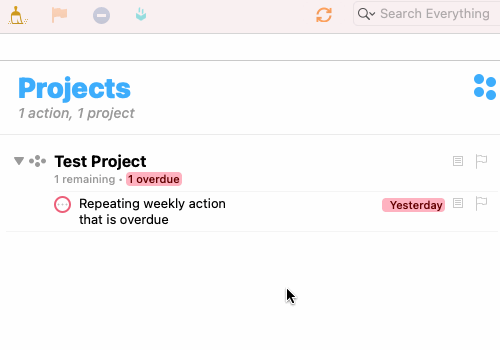
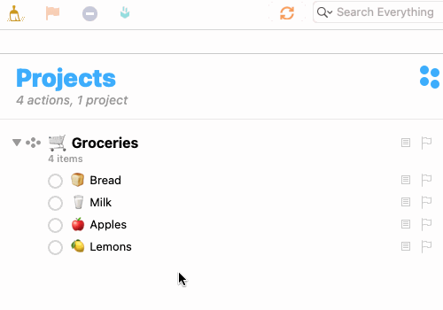

# OmniFocus Automation Scripts

This repo contains some automation scripts for OmniFocus that I use daily. They might be useful to other OmniFocus users out there.

See Omni's [automation website](https://omni-automation.com) for more info on how to use these scripts.

## Drop and Dupe

This script covers a fringe case that I kept encountering with repeating actions.

Consider this scenario:

I mostly have my repeating actions setup to repeat from their **assigned dates** (vs from their completion date). I like to use them to keep to routines. If however, I miss one, and I don't want it to sit in the red in my Forecast until I catch up, I have to adjust its due date. But with assigned dates, this would adjust it for all subsequent actions setup thereafter.

Instead, I started (manually at first) creating a copy of the repeating action as a single action, setting its due date to today (or to whenever I intend to catch up, obviously before the next scheduled repeat) and then I can now drop the overdue repeating action. OmniFocus will prompt whether I just want to drop this instance (and not the sequence), which I do. And that's it.

The manual process got tiresome though so I created a script to automate it called "Drop and Dupe".

This is what it looks like:

## Reset Project

This script is useful (particularly on mobile!) if you keep large re-usable lists of single actions e.g. a Groceries List and you want to reset them (so all actions are active again).

This is what it looks like:

